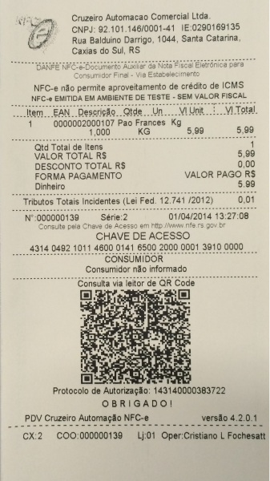
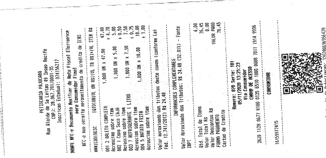

# API de Processamento de Notas Fiscais

Esta API REST foi desenvolvida em Python para receber, processar e armazenar notas fiscais eletrônicas. A solução utiliza serviços AWS como S3, Textract e CloudWatch, além de técnicas de NLP para extração e processamento dos dados.

## Tecnologias Utilizadas

Aqui está a lista das tecnologias utilizadas no seu projeto, atualizada conforme o código fornecido:

- **Python**: Linguagem principal para desenvolvimento da API (versão 3.x)
- **Flask**: Framework web utilizado para criar a API REST e rotas
- **Amazon S3**: Serviço de armazenamento via SDK boto3
- **Amazon Textract**: Para extração de texto das notas fiscais (OCR)
- **Google Gemini API**: Modelo de linguagem (LLM) para processamento e estruturação dos dados
- **Boto3**: Biblioteca Python oficial para integração com serviços AWS
- **python-dotenv**: Para gerenciamento de variáveis de ambiente
- **Logging**: Módulo nativo do Python para registro de logs
- **JSON**: Para manipulação e formatação dos dados de resposta


## Passos para Execução

## Instalação
1. Clone o repositório:
```bash
git clone [<repositorio>](https://github.com/EduAugustoM/leitor-de-notas-fiscais.git)
cd leitor-de-notas-fiscais
```

2. Crie e ative um ambiente virtual:
```bash
python -m venv venv
source venv/bin/activate  # Linux/Mac
venv\Scripts\activate  # Windows
```

3. Instale as dependências:
```bash
pip install -r requirements.txt
```

## Configuração
1. Renomeie `.env.example` para `.env` e preencha as variáveis:
```
AWS_ACCESS_KEY_ID=your_access_key
AWS_SECRET_ACCESS_KEY=your_secret_key
AWS_DEFAULT_REGION=us-east-1
GEMINI_API_KEY=your-key
```

2. Configure o bucket S3 com as pastas:
- `dinheiro/` para notas pagas em dinheiro ou PIX
- `outros/` para demais formas de pagamento

## Uso da API

### Endpoint
```
POST /api/v1/invoice
```

### Exemplo de Requisição (curl)
```bash
curl --location --request POST 'http://<URL>/api/v1/invoice' \
--form 'file=@"nota_fiscal.jpg"'
```

### Resposta de Sucesso (200 OK)
```json
{
    "nome_emissor": "Cruzeiro Automacao Comercial Ltda.",
    "CNPJ_emissor": "92.101.146/0001-41",
    "endereco_emissor": "Rua Balduino Darrigo, 1044",
    "CNPJ_CPF_consumidor": null,
    "data_emissao": "01/04/2024",
    "numero_nota_fiscal": "4314",
    "serie_nota_fiscal": "2",
    "valor_total": "5.99",
    "forma_pgto": "Dinheiro"
}
```

### Possíveis Códigos de Resposta
- 200 OK: Processamento concluído com sucesso
- 400 Bad Request: Arquivo não enviado ou inválido
- 500 Internal Server Error: Erro no processamento

### Notas utilizadas no teste
 

## Autor
[GitHub](https://github.com/EduAugustoM) | [LinkedIn](https://www.linkedin.com/in/eduardo-augusto-mendes/) 
